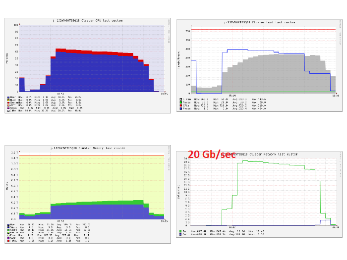

# Supercomputing for Big Data: Lab 2 - Group 25


# Introduction
In this second lab we will see the behavior of our first lab's implementation running on a real cluster. Through a series of measurements with different settings, we will check how our implementation will scale up/out.

As forecasted in the first lab and seen in the feedback session, we opted to continue with the dataframe implementation, because on the long run it will be faster than the RDD one, showing the real advantages of the optimizations.

# Recap of the implementation
Just as a quick recap, our dataframe implementation works as the following. We opted for a more SQL-like approach. We load all the segments using the schema provided in the manual of the course: out of all the fields provided we are only interested in *DATE* and *AllNames*. Hence, we filter out all the entries with a *null* name and we select only these two columns. Futhermore, we change the format of the date, because we are not interested in the hour. Later, we need to process somehow the *AllNames* attribute, since each row contains a series of names, each associated with a number. 

We proceed by first removing the number associated with each name and then we split the names present in each row, since now they are separated by semi-colons. Since now we are in the optimal configuration where each row is composed by *(date, single_name)*, we perform a *GroupBy* followed by *Count* operation to count the occurrence of each name by day. Finally, for each day we can order the names' count in a descending order and display only the first 10.

It is important to notice in this context that we have only one transformation that is causing a shuffle in the data, that is the *GroupBy* transformation needed to count the occurrence of each name on a single day.

# Metric 
We decided to change the metric we used in the first lab. In fact, in lab 1 we proposed a too "simple" metric, saying that we would have been interested only in the money spent. We realized however that this is not a sufficient metric given that we could also spend the lowest amount of money for a job that would take days or even months to be completed. For this reason, we decided to propose a metric that is a combination of money and time required for a job.

The equation is: 

We chose this metric because we realized both high values for *t* (time: expressed in hours) and *m* (money: expressed in dollars) are to be considered not good, thus the metric would be very low if one (both) is (are) high. We decided to express the time in hours and not in minutes or seconds because the two terms of the equation *t* and *m* needed to be in the same order of magnitude. We aim at an application that does not take too long and that does not cost too much. 
In general, this is a good metric to compare different cluster settings that are running on the same amount of segments.

# Test with other instances
Instead of trying already with the cluster made of 20 _c4.8xlarge_ instances, we decided to approach the problem gradually, by trying to scale up and scale out the problem. We made different calculations on 3k, 10k and 30k segments with clusters with different composition. The result are reported in the figure below.

**Figure 1.** *Metric behaviour for different clusters.*

As it is possible to notice, according to our metric, clusters with very high memory and network bandwidth are not suited for processing small batches of data. This may be due to the higher cost they have, since the time we save by using this more powerful cluster is not enough to balance the other term in the equation. The situation is the opposite in case of clusters made of powerful machines that process larger batches. There, the potentialities of the clusters, show their's value and our metric confirm this behavior.

**NOTE**: just out of curiosity, we decided to try also a small cluster of fast machines (*5 c4.4xlarge*). We ended up having the same times we had for the *20 m.large* cluster, while paying more money, thus it resulted as the worst experiment according to our metric. 

In the table below there are reported the time and money spent on each run.

| Instance Type | # Instances | #Segments |    Time   |  Money  | exp(-(t+m)) |
|:-------------:|:-----------:|:---------:|:---------:|:-------:|:-----------:|
|    m.large    |      20     |     3k    |  2min 1s  | $0.0672 |    **0.905**    |
|    m.large    |      20     |    10k    |  5min 12s |  $0.173 |    **0.772**    |
|    m.large    |      20     |    30k    | 16min 20s |  $0.544 |    0.443    |
|   c4.4xlarge  |      5      |     3k    |  1min 56s |  $0.128 |    0.745    |
|   c4.4xlarge  |      5      |    10k    |  5min 20s |  $0.354 |    0.643    |
|   c4.4xlarge  |      5      |    30k    | 16min 34s |  $1.098 |    0.253    |
|   c4.4xlarge  |      20     |     3k    |    25s    |  $0.110 |    0.889    |
|   c4.4xlarge  |      20     |    10k    |  1min 14s |  $0.327 |    0.707    |
|   c4.4xlarge  |      20     |    30k    |  2min 2s  |  $0.539 |    **0.564**    |

**NOTE**: 
Although we were using spot instances, to calculate the metric, we used on-demand price to be consistent, as prices of spot machines change based on current load.

# Test with *c4.8xlarge*
After these tests, we saw that our implementation works fine for the task and it is scaling up/out properly. Hence, we decided to try to process whole dataset on a big cluster with the recommended machines, namely *20 c4.8xlarge*. This means we have a cluster with 1200GB of memory and 720 vCPUs. The entire dataset has size ~4.1TB.

At first, we had problems in running the entire dataset because of memory errors: the cluster was not able to accept that huge amount of data in its standard settings. After debugging, we found out the problem was in the driver's memory: indeed, with an additional `spark-submit` command (namely, `--driver-memory`) we set the driver memory to 2GB instead of the default 512MB.

Our implementation completes the job in 5 minutes ad 5 seconds, for a total expenditure of $2.695; both metrics are far below the requirements reported in the lab manual, respectively below 30 minutes and $12. These results yield a metric of 0.0620. However, we decided to analyze the cluster performances to check the presence of eventual bottlenecks. Below are reported the visualizations obtained through Ganglia.



**Figure 2.** *Usage of resources for 20 c4.x8large machines.*


As it is possible to notice from the figures, no particual bottleneck that is slowing down eccessively the cluster exists (i.e., no clear peak or abnormal behavior appears in the graphs). However, we can clearly see that the the cpu (~55%) and memory usage can still be higher. As the memory is probably bounded by some spark configuration (Spark application filters most of the data at start so we don't really need high memory limit), the CPU seems like it's waiting for I/O. Therefore, we decided to look for other machine type that has better bandwidth/vCores ratio.

# Further experiments
First, we opted to try others from c4 family as they are easier to compare with *c4.8xlarge* and they are compute optimized, which we thought is more suitable for application. 


**Figure 3.** *Characteristics of c4 family.*


In the table below we present outcome of series of measurments for th *c4* family:

| Instance Type | # Instances | Amount Processed |   Time   |  Money | exp(-(t+m)) |
|:-------------:|:-----------:|:----------------:|:--------:|:------:|:-----------:|
|   c4.8xlarge  |      20     |       4.1TB      | 5min 5 s | $2.695 |    0.0620   |
|   c4.8xlarge  |      15     |       4.1TB      | 7min 2 s | $2.784 |    0.0550  |
|   c4.4xlarge  |      30     |       4.1TB      | 6 min 28s | $2.587 |    0.0675 |
|   c4.4xlarge  |      20     |       4.1TB      | 8min 48s | $2.334 |  **0.0837**|
|   c4.4xlarge  |      15     |       4.1TB      | 13min 7s| $2.587 |    0.0606 | 
|   c4.4xlarge  |      10     |       4.1TB      | 18min 58s| $2.521 |    0.0606 |
|   c4.2xlarge  |      30     |       4.1TB      | 12min | $2.388 |    0.075|
|   c4.2xlarge  |      20     |       4.1TB      | 17min 53s| $2.388 |    0.068|
|   c4.2xlarge  |      15     |       4.1TB      | 24min 3s| $2.388 |    0.0615 | 
|   c4.2xlarge  |      10     |       4.1TB      | 37min | $2.454 |    0.0464 | 

As, it turned out *c4.4xlarge* and *c4.2xlarge* has the same bandwidth/vCores ratio as *c4.8xlarge* (which was not obvious, since AWS labeled bandwidth available on the interface as *High*), so the characteristic we obtained in Ganglia were quite similar. Only in the case of running 20 *c4.4xlarge* machines,we obtained slightly higher CPU usage (~62%), which resulted in higher value of our metric.


**Figure 4.** *Usage of resources for 20 c4.x4large machines.*


We also decided to test out different machine types, namely *r5* family (memory optimized), *m5* family (general purpose) and *c5*, which is newer version of *c4*.

| Instance Type | # Instances | Amount Processed |   Time   |  Money | exp(-(t+m)) |
|:-------------:|:-----------:|:----------------:|:--------:|:------:|:-----------:|
|   c5.4xlarge  |      20     |       4.1TB      | 9min 36 s | $2.108 |    0.104  |
|   m5.4xlarge  |      20     |       4.1TB      | 7min 6s | $1.818 |  **0.1443** |
|   r5.4xlarge  |      20     |       4.1TB      | 9min 12s | $3.058 |  0.040 |

*c5* machines turned out to perform slower than *c4* but due to it's lower price, they resulted in higher metric. The performance of *r5* machines wasn't that great either and combined with their high price, they weren't good choice. However, *m5* family, namely *m5.4xlarge*, turned out to have better performance out of the box than *c4* machines. It's probably because the *m5.4xlarge* has the same amount of vCores as *c4.4xlarge*, but has little bit higher bandwidth available (cumulative was about 12,5Gb/sec whereas for *c4* it was about 10Gb/sec), which results in better bandwidth/vCores ratio and therefore, better CPU usage (~75%).


**Figure 5.** *Usage of resources for 20 m5.x4large machines.*


In the table below we present some more measurments for *m5* machines clusters:

| Instance Type | # Instances | Amount Processed |   Time   |  Money | exp(-(t+m)) |
|:-------------:|:-----------:|:----------------:|:--------:|:------:|:-----------:|
|   m5.12xlarge  |      20     |       4.1TB      | 4min 30 s | $3.456 |    0.0293  |
|   m5.4xlarge  |      30     |       4.1TB      | 6min 12 s | $2.381 |    0.0834  |
|   m5.4xlarge  |      20     |       4.1TB      | 7min 6s | $1.818 |  **0.1443** |
|   m5.4xlarge  |      15     |       4.1TB      | 9min 31s | $1.843 |  0.1352  |
|   m5.4xlarge  |      10     |       4.1TB      | 13min 20s| $1.702 |   **0.1459** | 
|   m5.4xlarge  |      5      |       4.1TB      | 25min 43s| $1.6448 |  0.1258  |
|   m5.2xlarge  |      20     |       4.1TB      | 7min 6s | $1.856 |  0.1227   |


In the end the best configuration, based on our metric, turned out to be 10 *m5.2xlarge* with the value of our metric 0.1459. However, since in this configuration, it takes a bit longer to process whole dataset, for further optimizations we decided to pick 2 other clusters: 20 *c4.4xlarge* and 20 *m5.4xlarge*, simply because they're a bit faster.


# Tuning Spark

Having our best cluster setups, we decided to try to tune spark and yarn options to increase the performance of our application. We decided to take a closer look on how Spark on EMR behaves in 3 different configuration versions:

1.  **EMR default configuration**

    As it turns out, AWS EMR sets up spark options with some predefined values based on the type of machine, that we're using in our cluster. 
    
    
    **Figure 6.** *Characteristics of Spark defaults set by EMR.*
    
    For the *c4* machines family, which is supposed to be compute optimized, it determines the number of executors in a way that each will have 4 vCores assigned.

    
    **Figure 7.** *Executors for 20 c4.4x large machines cluster.*

    So for *c4.8xlarge*(36 vCores), *c4.4xlarge*(16 vCores), *c4.2xlarge*(8 vCores) it creates 9, 4, 2 executors per machine respectively.

    For the *r5* family, which is supposed to be memory optimized, it creates 1 exectuore per vCore. The obvious downside of this approaach is that it’ll not be able to take advantage of running multiple tasks in the same JVM. 

    For the *m5* family, which serves as *general purpose*, it opts to always have 2 vCores assigned to each executor. We can see that it's somewhat balanced approach between memory and compute oriented machines.

    **NOTE**:
    All the results to this point, were obtained using the deafult EMR configuration.

2. **Enabling maximum resource allocation option**

    [1] gives a hint that it is possible for spark to set option *maximizeResourceAllocation* to *true*. This option will set some spark options based on this table :

    
    **Figure 8.** *Characteristics of Spark defaults set by EMR when mxaimizing resource allocation.*

    First, we tried this out with 20 *c4.x4large* machines. Passing this configuration:
    ```json
    [
        {
            "Classification": "spark",
            "Properties": {
                "maximizeResourceAllocation": "true"
            }
        }
    ] 
    ```
    to our spark application, yielded some strange result at first. Spark during runtime created 38 executors, where each had maximum number of vCores (16) assigned and half of them processed all the data and other half did just small amount of tasks as can be seen in the picture below:

    
        **Figure 9.** *Executors for 20 c4.4x large machines cluster with maximized allocation. (1)*

    This behaviour was caused by the *spark.dynamicAllocation* option enabled. As the documentation states [1], *spark.dynamicAllocation* option is set to *true* by default. In this case, at some point Spark decided to kill all the executors and create new ones for some reason. We didn't obtain better resources usage and our application finished after 11 minutes (8min 48s with default configuration).

    
    
    **Figure 10.** *Usage of resources for 20 c4.x4large machines when maximizing resource allocation. (1)*


    However, passing this configuration:
    ```json
    [
        {
            "Classification": "spark",
            "Properties": {
                "maximizeResourceAllocation": "true"
            }
        },
        {
            "Classification": "spark-defaults",
            "Properties": {
                "spark.dynamicAllocation.enabled": "false"
            }
        }
    ] 
    ```
    yielded more expected behaviour. In this case, Spark created one executor per machine and assigned to it maximum amount of the resources (16 vCores). 

            
    **Figure 11.** *Executors for 20 c4.4x large machines cluster with maximized allocation. (2)*

    Unfortunately, it also didn't result in increased usage of resources. I took 9.7 minutes for application to finish (8min 48s with default configuration).

    
        **Figure 12.** *Usage of resources for 20 c4.x4large machines when maximizing resource allocation. (2)*

    Next, we tried passing the second configuration, with dynamic allocation disabled, to 20 *m5.x4large* cluster. However, it also resulted in the downgrade of performance. Our application finished after 11.2 minutes (7min 6s with default configuration).

    Supposedly, the problem with very powerful executors is that, the HDFS client has troubles dealing with large amount of concurrent threads. It was observed, that HDFS achieves full write throughput with 5 cores per executor. We will try to examine this in the next point.

3.  **Setting our own spark options**

    We tried to follow the aws guide for maximizing spark performance [2]. For our 20 nodes *c4.4xlarge* cluster we calculated the following properties:

        spark.executor.cores = 5 (5 vcores per executor)
        spark.executor.instances = (3*20) - 1 = 59 (total number of executors)
        spark.executors.memory = (30/3) * 0.9 = 9G (Memory for 1 executor)
        spark.yarn.executor.memoryOverhead = (30/3) * 0.1 = 1G
        spark.driver.memory = spark.executors.memory = 9G
        spark.executor.instances = (3 * 20) - 1 = 59 (Total number of executors)
        spark.default.parallelism = spark.executor.instances * spark.executor.cores * 2 = 590
		spark.sql.shuffle.partitions = 590 

    ```json
    [
        {
            "Classification": "spark-defaults",
            "Properties": {
                "spark.dynamicAllocation.enabled": "false",
                "spark.executor.cores": "5",
                "spark.executor.instances": "59",
                "spark.executors.memory": "9G",
                "spark.yarn.executor.memoryOverhead": "1G",
                "spark.driver.memory": "9G",
                "spark.default.parallelism": "590",
                "spark.default.parallelism": "590", 
            }
        }
    ] 
    ```

    Unfortunately, for some reason spark can't create 3 executors with 5 vCores (which is quite strange, because by default Spark created 4 exectuors with 4 vCores each), so it only creates 2 executors per machine  with 5 vCores each, which results in underperformance. We can see that instead of 59, only 40 executors were created.

    
    **Figure 13.** *Executors for 20 c4.4x large machines cluster with our configuration.*

    
    **Figure 14.** *Usage of resources for 20 c4.x4large machines with our configuration.*


    Similarly for the *m5.x4large* we tried this configuration:
    
    ```json
    [
        {
            "Classification": "spark-defaults",
            "Properties": {
                "spark.dynamicAllocation.enabled": "false",
                "spark.executor.cores": "5",
                "spark.executor.instances": "59",
                "spark.executors.memory": "18G",
                "spark.yarn.executor.memoryOverhead": "3G",
                "spark.driver.memory": "18G",
                "spark.default.parallelism": "590",
                "spark.default.parallelism": "590", 
            }
        }
    ] 
    ```
    but the result was the same - less executors than configured and decrease in performance.

    
    **Figure 15.** *Usage of resources for 20 m5.x4large machines with our configuration.*

   

    Later on, we tried many different configuration setups, by adding and removing some options here and there, on many different clusters and still we weren't able to increase the performance. 


# Summary

In the end we didn't succeed in tuning our spark application. Since our application is quite straightforward (it doesn't use for instance: caching or broadcast variables) and we are using DataSets, which give us tons of optimization for free, it is quite hard to improve it's performance, especially for people new o spark, regarding that the default configuration that AWS sets up, turns out to be quite effective.

To improve the performance, it'd require to dive really deep into spark optimization techinques which was not feasible based on time and money limits. The fact that few days before the deadline, during the day, there were problems with provisioning spot machines was also slowing down work a little bit.

However, we managed to prove, that you can easily increase the preformance of your spark application, just by observing usage of resources and chosing the right type of machines.


# Resources 

[1] https://docs.aws.amazon.com/emr/latest/ReleaseGuide/emr-spark-configure.html#spark-defaults

[2] https://aws.amazon.com/blogs/big-data/best-practices-for-successfully-managing-memory-for-apache-spark-applications-on-amazon-emr/?fbclid=IwAR0FktESsXL5iFsnhwpqvXYfp7Dgj42mdT3aEqGfANTJsqPQXBDoB3so_Lk
    
