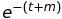

# Introduction
In this second lab we will see the behavior of our first lab's implementation running on a real cluster. Through a series of measurements with different settings we will check how our implementation will scale up/out.

As forecasted in the first lab and seen in the feedback session, we opted to continue with the dataframe implementation because on the long run it will be faster than the RDD one, showing the real advantages of the optimizations.

# Recap of the implementation
Just as a quick recap, our dataframe implementation works as the following. We opted for a more SQL-like approach. We load all the segments using the schema provided in the manual of the course: out of all the fields provided we are only interested in *DATE* and *AllNames*. Hence, we filter out all the entries with a *null* name and we select only these two columns. Futhermore, we change the format of the date, because we are not interested in the hour. Later, we need to process somehow the *AllNames* attribute, since each row contains a series of names, each associated with a number. 

We proceed by first removing the number associated with each name and then we split the names present in each row, since now they are separated by semi-colons. Since now we are in the optimal configuration where each row is composed by *(date, single_name)*, we perform a *GroupBy* followed by *Count* operation to count the occurrence of each name by day. Finally, for each day we can order the names' count in a descending order and display only the first 10.

It is important to notice in this context that we have only one transformation that is causing a shuffle in the data, that is the *GroupBy* transformation needed to count the occurrence of each name on a single day.

# Metric 
We decided to change the metric we used in the first lab. In fact, in lab 1 we proposed a too "simple" metric, saying that we would have been interested only in the money spent. We realized however that this is not a sufficient metric given that we could also spend the lowest amount of money for a job that would take days or even months to be completed. For this reason, we decided to propose a metric that is a combination of money and time required for a job.

The equation is: 

We chose this metric because we realized both high values for *t* (time: expressed in hours) and *m* (money: expressed in dollars) are to be considered not good, thus the metric would be very low if one (both) is (are) high. We decided to express the time in hours and not in minutes or seconds because the two terms of the equation *t* and *m* needed to be in the same order of magnitude. We aim at an application that does not take too long and that does not cost too much. 
In general, this is a good metric to compare different cluster settings that are running on the same amount of segments.

# Test with other instances
Instead of trying already with the cluster made of 20 _c4.8xlarge_ instances, we decided to approach the problem gradually, by trying to scale up and scale out the problem. We made different calculations on 3k, 10k and 30k segments with clusters with different composition. The result are reported in the figure below.

As it is possible to notice, according to our metric, clusters with very high memory and network availability are not suited for processing small batches of data. This may be due to the higher cost they have, since the time we save by using this more powerful cluster is not enough to balance the other term in the equation. The situation is the opposite in case of clusters made of powerful machines that process larger batches. Here the potentialities of the cluster show their value and our metric confirm this behavior.

_Note_: just out of curiosity, we decided to try also a small cluster of fast machines (*5 c4.4xlarge*). We ended up having the same times we had for the *20 m.large* cluster, while paying more money, thus it resulted as the worst experiment according to our metric. 

In the table below there are reported the time and money spent on each run.

| Instance Type | # Instances | #Segments |    Time   |  Money  | exp(-(t+m)) |
|:-------------:|:-----------:|:---------:|:---------:|:-------:|:-----------:|
|    m.large    |      20     |     3k    |  2min 1s  | $0.0672 |    **0.905**    |
|    m.large    |      20     |    10k    |  5min 12s |  $0.173 |    **0.772**    |
|    m.large    |      20     |    30k    | 16min 20s |  $0.544 |    0.443    |
|   c4.4xlarge  |      5      |     3k    |  1min 56s |  $0.128 |    0.745    |
|   c4.4xlarge  |      5      |    10k    |  5min 20s |  $0.354 |    0.643    |
|   c4.4xlarge  |      5      |    30k    | 16min 34s |  $1.098 |    0.253    |
|   c4.4xlarge  |      20     |     3k    |    25s    |  $0.110 |    0.889    |
|   c4.4xlarge  |      20     |    10k    |  1min 14s |  $0.327 |    0.707    |
|   c4.4xlarge  |      20     |    30k    |  2min 2s  |  $0.539 |    **0.564**    |

**NOTE**: we started using spot instances, but we had problems in getting some machines assigned. For this reason we opted to use on demand machines: we accepted to pay a little more, but at least we were sure that the instances were always reserved.

# Test with *c4.8xlarge*
After these test we saw that our implementation works fine for the task and it is scaling up/out properly. Hnece, it is moment to try the big cluster with the recommended machines, namely *20 c4.8xlarge*. This means we have a cluster with 1200GB of memory and 720 vCPUs. The entire dataset has size ~4.1TB.

At first, we had problems in running the entire dataset because of memory errors: the cluster was not able to accept that huge amount of data in its standard settings. After debugging, we found out the problem was in the driver's memory: indeed, with an additional `spark-submit` command (namely, `--driver-memory`) we set the driver memory to 2GB instead of the default 512MB.

Our implementation completes the job in 5 minutes ad 5 seconds, for a total expenditure of $2.695; both metrics are far below the requirements reported in the lab manual, respectively below 30 minutes and $12. These results yield a metric of 0.0620. However, we decided to analyze the cluster performances to check the presence of eventual bottlenecks. Here below are reported the visualization obtained through Ganglia.

As it is possible to notice from the figures, no particual bottleneck that is slowing down eccessively the cluster exists (i.e., no clear peak or abnormal behavior appears in the graphs). The only metric that may be considered *"abnormal"* is the network usage, where the graph shows that it is nearly all the time at peak usage with 20 GB/s of bandwidth. This pushed us into investigating more this aspect. Do we need more machines? Do we need the same amount of machines but with more bandwidth?

# Further experiments
We decided to investigate the second path, that is using the same amount of machines but with more bandwidth. Of course we could not jump to machines with completely different characteristics, e.g. we could not to the comparison between 20 *c4.8xlarge* machines and 20 *m.large* machines because the gap is too wide and affecting. Thus, we decided to opt for the *c4.4xlarge* machines. As the figure below shows, each machine has approximatively half of the values of a *c4.8xlarge* machine regarding the performances (that is, 16 vCPUs and 30GB of memory). The network performance however should be higher: even if for a *c4.8xlarge* machine is reported to have 10 Gigabit worth of network connection, and for *c4.4xlarge* only the label **high** is reported, the TAs reassured us that the ratio of network connection per number of CPUs is actually higher in *c4.4xlarge* machines.

Running the full dataset on a cluster of 20 *c4.4xlarge* machines took 8 minutes and 48 seconds and costed $2.334. The network performances are indeed better than the first solution, as the figure below shows.

On a first view, the overall performance could seem worse with respect to the initial cluster. If we take a look at the metric we have defined instead, we can see this values of money and time yield 0.0837, that is actually better than the original 0.0620.

| Instance Type | # Instances | Amount Processed |   Time   |  Money | exp(-(t+m)) |
|:-------------:|:-----------:|:----------------:|:--------:|:------:|:-----------:|
|   c4.4xlarge  |      20     |       1.9TB      | 4min 24s | $1.167 |    0.289    |
|   c4.4xlarge  |      20     |       4.1TB      | 8min 48s | $2.334 |    **0.0837**   |
|   c4.8xlarge  |      20     |       1.9TB      | 1min 32s | $0.813 |    **0.433**    |
|   c4.8xlarge  |      20     |       4.1TB      | 5min 5 s | $2.695 |    0.0620   |

Again, it is possible to notice a shift in the behaviour as the amount of data to process increases: it seems that the most powerful cluster outstands the competition until the network does not become too congested, in which case a cluster with higher network performances would prevale.

